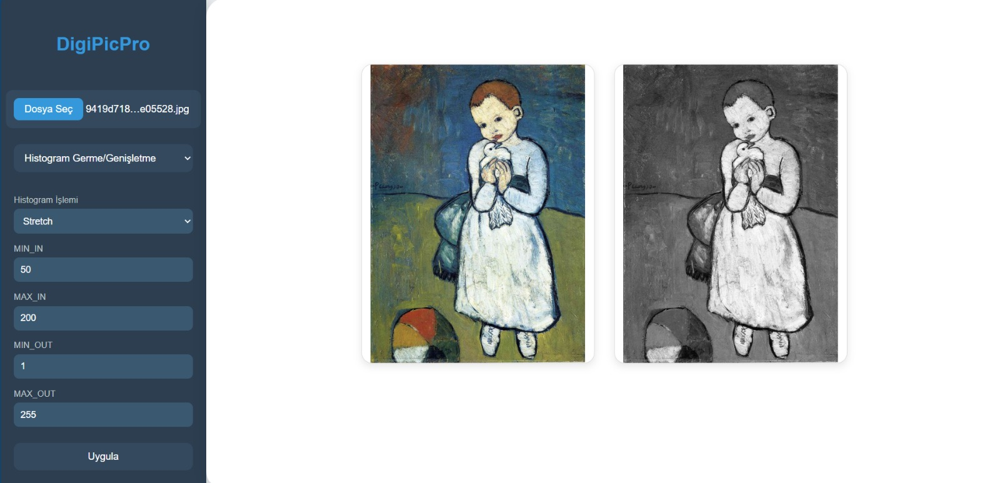

# Image Processing Application

This repository contains an image processing application developed using **Python** for the backend and **React** for the frontend. The application provides various image manipulation and analysis features through a modern web interface.

## Screen Shot



## Installation

1. Clone the repository:
   ```bash
   git clone https://github.com/melisaalara/image-processing.git

2. Backend setup (Python):
   ```bash
   cd backend  python -m venv venv
   source venv/bin/activate  # or venv\Scripts\activate on Windows
   pip install -r requirements.txt
   python app.py

4. Frontend setup (React):
    ```bash
    cd frontend
    npm install
    npm start

6. Open your browser and go to http://localhost:3000 to use the application.

#  Architecture Overview

Backend (Python): Handles image processing logic, REST API endpoints, and communicates with the frontend.

Frontend (React): User interface for uploading images, selecting processing options, and displaying results.

